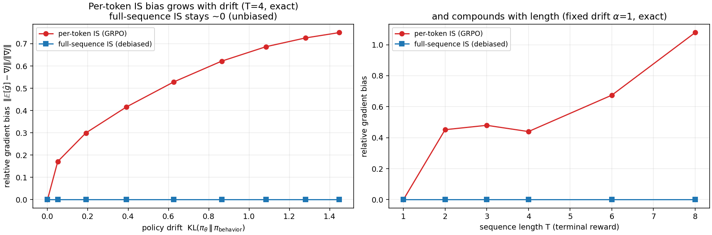
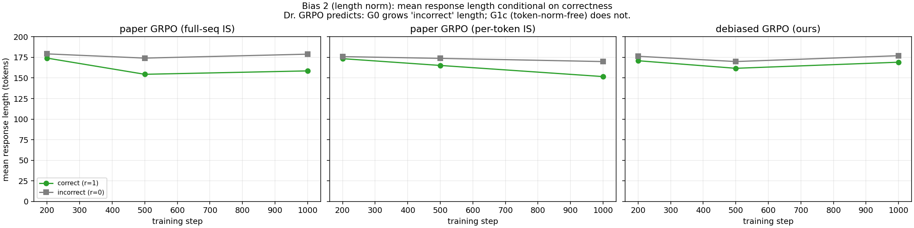
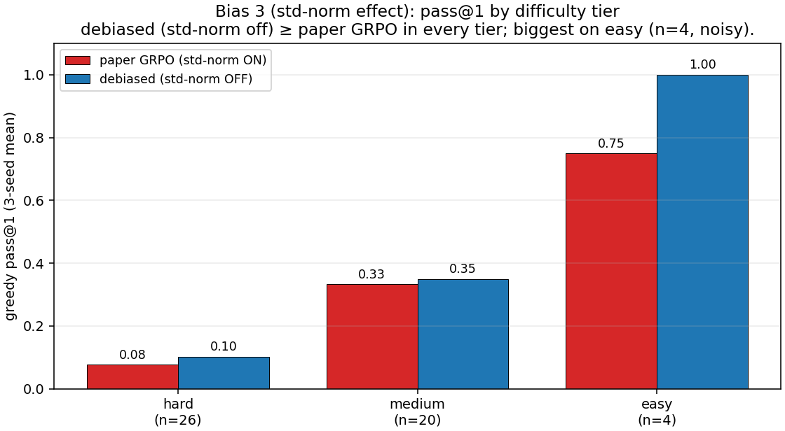
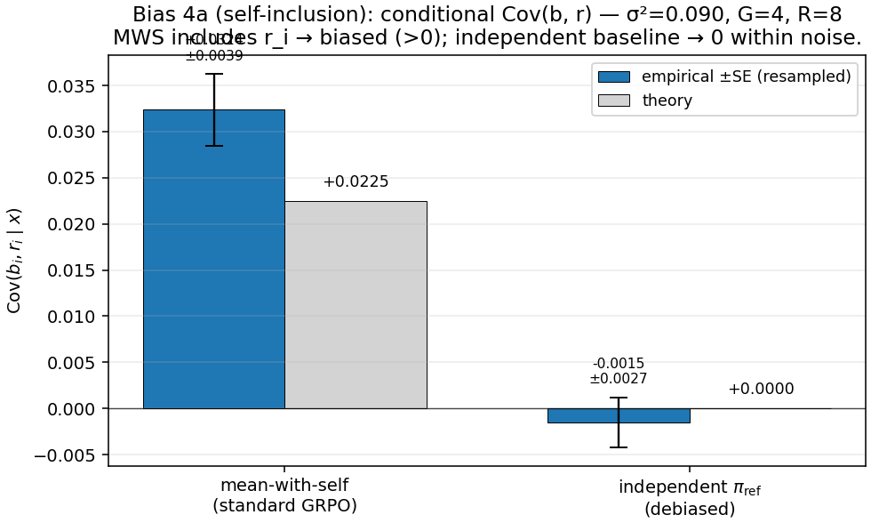
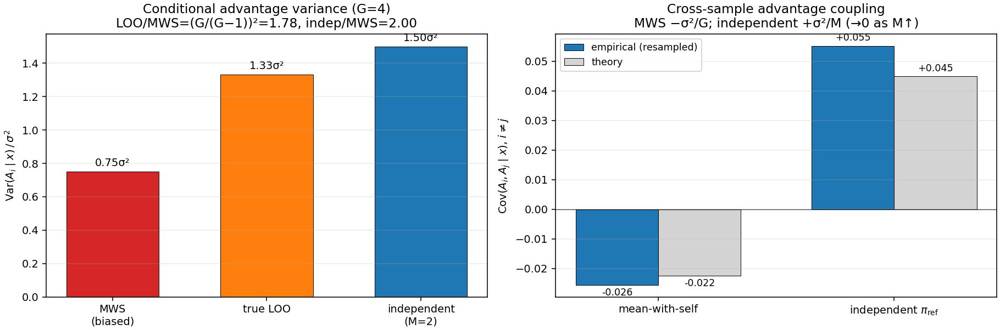

# debiased-grpo

**An (almost-)unbiased GRPO.** Standard Group Relative Policy Optimization
composes four distinct bias sources into one gradient estimator; debiased-grpo
replaces each with the unbiased choice — an independent π_ref baseline (removing
the correlated/self-inclusion baseline bias), fixed-constant group-level length
normalization (the Dr. GRPO length-bias fix), std-normalization turned off
(removing a changed-objective distortion), and **full-sequence importance
sampling** (the unbiased off-policy correction for a terminal reward) in place of
the per-token IS surrogate that paper-GRPO under-corrects with. Only two
approximations remain, and we state both honestly: a log-space **clamp** on the
summed IS log-weight (a numerical guard against the log-normal variance of
full-sequence IS), and a KL penalty estimated with Schulman's k3 estimator from
behavior-policy samples (a small bias early in training). The method is therefore
*almost*-unbiased — not strictly unbiased, and not the only possible unbiased
formulation.

The central tradeoff is explicit: **full-sequence IS is unbiased but
higher-variance** (the weight is log-normal with variance growing exponentially
in sequence length). That is exactly why people use per-token clipping instead;
the clamp bounds the variance, but whether unbiased-higher-variance actually
beats biased-stable GRPO is an **open empirical question** at this scale. On
GSM8K / Qwen2-0.5B the debiased model posts the **higher 3-seed pass@1 mean
(0.187 vs Standard GRPO's 0.147)** but with overlapping 95% CIs, so *consistent
with ≥ GRPO* rather than decisively better. The real tradeoff is **stability**:
standard GRPO's per-token PPO clip makes it rock-stable (0% loss spikes), while
the unclipped debiased estimator pays heavy-tailed instability (spikes on ~24% of
steps; the ±5 clamp caps a would-be NaN) that recovers without divergence. The sharper, noise-free results
are the **bias diagnostics** and the **unbiasedness proof**
(`tests/test_unbiasedness.py`), which the results below lead with.

---

## Quick start

```bash
make env && make install        # conda env + deps (PyTorch, TRL, QLoRA stack)
make test                       # CPU tests, no model download (incl. the unbiasedness proof)
make train-g0a                  # Standard GRPO baseline (paper Eq. 3, per-token clipped IS)
make train-debiased             # debiased GRPO (indep baseline + full-seq IS + log-clamp)
make diagnose && make plot-diagnostics   # per-bias-source diagnostics on checkpoints
```

The loss is flag-driven (`scripts/train_grpo.py`); every cell in
[`notes/experiments.md`](notes/experiments.md) is one combination of CLI flags
over a single shared trainer.

---

## Motivation

Group Relative Policy Optimization (GRPO), introduced by the DeepSeekMath team
(Shao et al., 2024) and scaled in DeepSeek-R1 (2025), is the dominant algorithm
for RL fine-tuning of LLMs on reasoning tasks: by dropping the learned value
network and using within-group reward normalization as a baseline, it reaches
PPO-competitive results at a fraction of the memory.

A wave of 2025–2026 analysis shows that standard GRPO's gradient estimator is
biased in several coupled ways. debiased-grpo isolates **four** named sources and
substitutes the unbiased choice for each:

1. **Biased per-token IS surrogate.** GRPO weights each token by a per-token ratio
   (DeepSeekMath Eq. 3). For a **terminal** reward (GSM8K gives one reward for the
   whole completion), that under-corrects — the reward depends on the whole
   trajectory, so each token's score must be reweighted by the *full-sequence*
   ratio w(y) = exp(Σ_t log ρ_t). **Fix:** *full-sequence IS*, computed by summing
   per-token log-ratios and exponentiating once (numerically stable), with a
   log-space clamp for the tail.

2. **Length bias.** Per-response 1/T_i normalization gives short correct
   responses disproportionately large updates and pressures the policy toward
   longer incorrect ones (Liu et al., 2025, Dr. GRPO). **Fix:** *fixed-constant
   (group-level) length normalization* — preserves the unbiased gradient
   direction.

3. **Std-normalization objective distortion.** Dividing advantages by the
   per-prompt reward std puts a data-dependent 1/σ(x) factor *inside* the
   expectation, so the optimized objective is a prompt-reweighted reward, not
   expected reward. **Fix:** *std-norm off*.

4. **Correlated-baseline bias.** The leave-one-out / mean-with-self baseline
   includes (or correlates with) the rollout it scores, so once an importance
   weight is present the baseline-subtraction identity breaks (Yang et al., 2026
   formalize the difficulty-dependent direction of the bias). **Fix:** an
   *independent π_ref baseline* — M separate frozen-reference rollouts. Unbiased,
   and (per the Bias 4 diagnostic) the only baseline that doesn't couple the
   per-sample gradients — at a small, M-tunable variance cost (`σ²(1+1/M)`).

### What stays honest

- **Two residual approximations**, not zero: (a) the log-weight **clamp** at 5.0
  (bounds the log-normal IS variance — the otherwise unbounded
  `exp(Σ log ρ_t)`), and (b) the KL penalty is **Schulman's k3** estimator
  computed from behavior-policy samples, which carries a small bias early in
  training when π_θ ≈ π_behavior has not yet held. So this is *almost*-unbiased.
- **The variance tradeoff is real.** Full-sequence IS is unbiased but its weight
  is log-normal with variance ∝ exp in T; per-token clipping is the standard
  biased-but-stable alternative. The clamp bounds the variance; whether the
  unbiased-clamped estimator beats biased-stable GRPO is **not settled** here.

---

## Bias diagnostics (the verified result — lead here)

Each bias source standard GRPO carries is verified directly. Diagnostics are
computed on the trained checkpoints (steps 200/500/1000) plus two exact
enumeration / resampling studies; reproduce with `make diagnose plot-diagnostics
per-token-bias bias1-isweight`. Full write-up + every number in
[`notes/bias_diagnostics.md`](notes/bias_diagnostics.md).

### Bias 1 — per-token IS surrogate is biased for a terminal reward (the reason for full-sequence IS)

GRPO (Eq. 3) reweights each token by its own ratio `ρ_t`, then averages. For a
**terminal** reward the correct off-policy weight is the *full-sequence* ratio
`∏_t ρ_t`; the per-token surrogate drops the rest of the trajectory and is
**biased once π_θ ≠ π_behavior**. Exact enumeration (`scripts/per_token_bias.py`,
relative gradient bias `‖E[ĝ]−∇J‖/‖∇J‖`, averaged over 8 setups, zero MC noise):



| | KL(π_θ‖π_behavior) ≈ 0.4, T=4 | T=8, drift α=1 |
|---|---|---|
| full-sequence IS (debiased) | **1.6e-7** | **4.7e-7** |
| per-token IS (GRPO) | **0.44** | **1.08** |

Full-sequence IS is the on-policy gradient in expectation (machine-zero bias, any
baseline, any drift); per-token IS bias **grows with drift and compounds with
length**. This is an exact algebraic fact, not a noisy measurement (**supported**).

### Bias 1′ — full-sequence IS variance (the cost of the fix)

The unbiased estimator's price is variance: `Var(log w) ≈ T·σ²`, log-normal.
Reproducible via `scripts/bias1_isweight.py` + the `train/clamp_fire_frac` log. The
inner-loop IS weight (π_θ/π_behavior) is mild *on average* (per-token log-ratio std
≤ 0.07) but **heavy-tailed** — dropping PPO clip lets the summed log-weight blow
past ±5 on spike steps (peak **24** ⇒ e²⁴ pre-cap, clamp firing on **75%** of
sequences), so the **±5 clamp is the active NaN guard**. Cost: `debiased` spikes
`|loss|>10` on **6/25** steps (−37→+37), bounded by the clamp, and recovers — no
divergence. (The `ess_full_vs_pertoken.png` ECDF in the notes shows the
drift-from-ref log-weight distribution; the legible summary is the std/spike/ESS
numbers here.)

### Bias 2 — per-response length normalization

GRPO's `1/|o_i|` divisor pressures shorter-correct / longer-incorrect responses.
The incorrect−correct length gap grows to **+18 tokens** for standard GRPO (`g0a`)
by step 1000 (+20 for the `g0` full-seq ablation); debiased's fixed-constant
aggregator holds it **flat at ≈ +8** (**supported**).



### Bias 3 — std normalization

`1/σ(reward|x)` reweights prompts by difficulty (a changed objective). 3-seed
greedy pass@1 by difficulty tier — debiased (std-norm off) ≥ GRPO in **every** tier
(hard 0.10 vs 0.08, medium 0.35 vs 0.33, easy 1.00 vs 0.75 on n=4): turning it off
does not hurt; the tilt is **mild for binary GSM8K rewards** (**supported, small**).



### Bias 4 — self-inclusion baseline (+ variance / gradient-coupling)

The mean-with-self baseline includes `r_i`, so it correlates with the reward it
scores. Conditional `Cov(b_i, r_i | x)` (multi-group resampling, ±bootstrap SE):
**+0.032 ± 0.004** for MWS (theory `σ²/G` = +0.022, ≈ 8 SE above 0) vs **−0.0015 ±
0.0027** for the independent baseline (theory 0) — MWS is conditionally biased; the
independent baseline is **consistent with 0 within noise** (not identically 0 — it's
a finite-sample estimate, with 37/50 prompts contributing nonzero `b_ind` variance).
The advantage-variance ratios (MWS 0.75σ² biased / LOO 1.33σ² / independent 1.50σ²,
`Var(indep)/Var(MWS)` = 2.0) are **theoretical**, verified to high precision by the
2M-sample simulation in `tests/test_baseline_algebra.py`; only the independent
baseline avoids coupling the per-sample gradients through shared rewards
(empirical cross-cov: MWS −0.026, independent +0.055 — a vanishing shared offset)
(**supported**).




---

## Results — Qwen2-0.5B / GSM8K

A minimal-scope experiment on a single RTX 3060 Ti (8 GB) using QLoRA (4-bit
NF4, r=16) on Qwen2-0.5B, 4 gradient rollouts + 2 independent baseline rollouts
per prompt, μ=4 inner steps, max_new_tokens=192.

### Cells

| Configuration | code | make target |
|---|---|---|
| **Standard GRPO** (the paper — per-token clipped IS, DeepSeekMath **Eq. 3**; MWS baseline, per-response length, std-norm) | `g0a` | `train-g0a` / `-s43` / `-s44` |
| GRPO + full-sequence IS — *IS-granularity ablation* (= `g0a` with full-seq IS swapped in; isolates the non-IS fixes when compared to debiased) | `g0` | `train-g0` / `-s43` / `-s44` |
| **Debiased GRPO** (indep baseline + full-seq IS + log-clamp + fixed-const length + no std-norm) | `debiased_grpo` | `train-debiased` / `-s43` / `-s44` |

`g0a` is the faithful paper algorithm (per-token ratio `π_θ(o_t|o_<t)/π_old(o_t|o_<t)`,
clipped, in DeepSeekMath Eq. 3) and is **the GRPO baseline**. `g0` is *not* a
published algorithm — it swaps full-sequence IS into GRPO so that `debiased` vs `g0`
holds IS-granularity fixed and isolates the baseline/length/std fixes; `g0` vs `g0a`
then isolates the IS-granularity axis on its own.

### Final GSM8K val pass@1

Greedy val pass@1 at the last eval (outer step 199 of 250), 3 seeds (42 / 43 / 44).
The baseline is **Standard GRPO (`g0a`)** — the paper's per-token-clipped algorithm.

| Configuration | s=42 | s=43 | s=44 | mean | std | 95% CI (t, n=3) |
|---|---|---|---|---|---|---|
| **Standard GRPO** (`g0a`, paper Eq. 3 — per-token clipped IS, MWS, per-resp. length, std-norm) | 0.13 | 0.18 | 0.13 | **0.147** | 0.029 | ±0.072 |
| **Debiased GRPO** (`debiased_grpo`) — indep baseline + full-seq IS + ±5 log-clamp + fixed-const length + no std-norm | 0.15 | 0.20 | 0.21 | **0.187** | 0.032 | ±0.080 |
| _ablation:_ GRPO + full-seq IS (`g0`) — IS-granularity control | 0.17 | 0.15 | 0.19 | 0.170 | 0.020 | ±0.050 |

The headline comparison is **debiased (0.187) vs Standard GRPO `g0a` (0.147)** — a
+0.040 mean edge, but the 95% CIs (±0.080 / ±0.072) overlap, so *suggestive, not
significant* at n=3, N=100. The `g0` row (0.170) is the IS-granularity ablation:
debiased vs `g0` holds IS fixed and isolates the baseline/length/std fixes (+0.017);
`g0` vs `g0a` isolates the IS-granularity axis alone (within noise, both clip-stable).

### Key takeaways

1. **Higher mean than the paper baseline, but not a clean win.** Debiased GRPO's
   3-seed mean (**0.187**) is +0.040 over Standard GRPO `g0a` (**0.147**) and +0.017
   over the IS-controlled `g0` ablation (0.170). All 95% CIs overlap (±0.072–0.080),
   so the honest read is *consistent with debiased ≥ GRPO* at this scale, not
   *better than*. A larger eval set and more seeds would be needed to call it.
2. **The real tradeoff is stability, and the clamp is load-bearing.** Standard
   GRPO's per-token PPO clip makes it rock-stable (**0% loss spikes** across seeds);
   so does the `g0` ablation. The unclipped debiased estimator is the higher-variance
   one (full-vs-cumulative growth, Bias 1′, confirms the `T·σ²` mechanism): its
   inner-loop IS weight is mild *on average* (per-token log-ratio std ≤ 0.07) but
   heavy-tailed — dropping the clip lets the summed log-weight spike past ±5 (peak
   24, clamp firing on 75% of seqs), where the ±5 clamp caps a would-be NaN. Cost:
   debiased hits `|loss|>10` on **~24%** of logged steps (−37→+37) where the clipped
   cells stay flat — bounded by the clamp and recovered without divergence. The
   performance-variance story (higher seed std) and the within-run instability line up.
3. **The bias diagnostics are the strongest result** — each named bias behaves as
   the theory predicts (the per-token IS bias is exactly 0.44–1.08 of the gradient
   norm while full-seq IS is ~0; the length gap +18 tokens for GRPO vs +8
   debiased; conditional self-inclusion `Cov(b,r|x)` +0.032±0.004 MWS vs
   −0.0015±0.0027 independent — i.e. 0 within noise), independent of the pass@1 noise.

### Caveats

- **Within-noise headline.** The pass@1 edge sits inside the overlapping 95% CIs;
  treat the ranking as suggestive. The diagnostics and the unbiasedness proof are
  the verified contributions, not the leaderboard.
- **The variance tradeoff is real; the clamp is doing the work.** Full-sequence IS
  is unbiased but higher-variance. The inner-loop IS weight is mild on average but
  heavy-tailed; the ±5 clamp fires on the spike steps (caps e²⁴-scale weights to
  e⁵) and is what keeps training from diverging to NaN. At larger scale / longer
  completions / higher μ the tail — and the clamp's residual tail bias — would grow
  further. Stability here came from the clamp catching those tails, not from the
  tails being absent.
- Single 0.5B model, single benchmark (GSM8K), sparse-terminal reward.
- Pass@1 is greedy on a 100-prompt val subset (N=100), so small gaps sit within
  the eval-set noise band.
- μ=4 inner-loop steps deviate from the DeepSeekMath GRPO paper's μ=1 default —
  at μ=1 the IS ratio is identically 1 and there is no within-loop drift for any
  IS estimator to correct. The same μ=4 is held across all cells for an
  apples-to-apples comparison.

Reproducible commands: `make train-g0`, `make train-g0a`, `make train-debiased`,
`make train-debiased-s43`, `make train-debiased-s44`, `make train-g0-s44`. See
[`notes/experiments.md`](notes/experiments.md) for
the run table and [`notes/bias_diagnostics.md`](notes/bias_diagnostics.md) for
the full bias-source verification.

---

## The Four Bias Sources in Standard GRPO

All four appear directly in the GRPO objective (DeepSeekMath Eq. 3): the per-token
ratio, the `mean(r)`/`std(r)` group baseline, and the `1/|o_i|` length divisor.

### Bias 1: Per-Token IS Surrogate (biased for a terminal reward)

GRPO reweights each token by its own ratio `ρ_t = π_θ(o_t|o_<t)/π_θ_old(o_t|o_<t)`,
clipped. For a **terminal** (sequence-level) reward the unbiased off-policy weight
is the *full-sequence* ratio `w(y) = ∏_t ρ_t`; the per-token surrogate drops the
rest of the trajectory's likelihood, so its expected gradient deviates from the
true policy gradient once `π_θ ≠ π_behavior` — a bias that grows with policy drift
and compounds with sequence length (exact enumeration, Bias 1 diagnostic above).
**Fix:** *full-sequence IS*, `w(y) = exp(Σ_t log ρ_t)` (sum log-ratios, exponentiate
once — numerically stable), unbiased for the terminal reward.

> **The cost of this fix — full-sequence IS variance.** `w(y) = ∏_t ρ_t` is
> log-normal with `Var(log w) ≈ T·Var[log ρ_t]`, growing in T. This is the *price*
> of unbiasedness, not a separate GRPO bias — it is why a numerical control (the ±5
> log-weight clamp) is needed and why per-token clipping is the tempting biased
> alternative. Quantified in the "Bias 1′" diagnostic.

### Bias 2: Per-Response Length Normalization

Averaging token gradients within a response divides by T_i, giving short correct
responses larger per-token updates and long incorrect responses smaller
penalties — a length-reweighted objective, not expected reward.

### Bias 3: Std Normalization

Dividing the centred reward by per-prompt σ(x) inserts a data-dependent 1/σ(x)
factor inside the expectation, optimizing reward-per-unit-variance rather than
expected reward.

### Bias 4: Correlated / Self-Inclusion Baseline

Paper-GRPO's baseline b_mean = (1/N)·Σ_j r_j includes r_i, so it depends on the
action a_i it scores. Once an importance weight is present, the
baseline-subtraction identity E[w · (r_i − b) · ∇log π_θ] = 0 no longer holds:
the bias vanishes only when π_θ = π_behavior (no policy movement). Yang et al.
(2026) show the bias direction is difficulty-dependent — hard prompts'
advantages are systematically underestimated, distorting exploration.

**Why the independent baseline (and not LOO).** There are two unbiased fixes, and
they differ on more than variance (all quantities conditional on the prompt x,
σ² = Var(r|x), group size G, M independent ref rollouts; derivations in
`notes/derivation.md` §5b, verified in `tests/test_baseline_algebra.py`):

- *Per-sample variance.* MWS 0.75σ² (but biased) < LOO `σ²·G/(G−1)` = 1.33σ² <
  independent `σ²(1+1/M)` = 1.50σ² at M=2. LOO is the lower-variance unbiased
  option at small M — but the independent baseline's variance is **tunable**:
  `1+1/M → 1` as M grows, so adding ref rollouts closes the gap.
- *Cross-sample gradient coupling.* This is the deciding axis. MWS and LOO both
  make advantage `A_i` a **function of the other samples' rewards** (the
  group / leave-one-out mean), introducing a negative cross-sample covariance
  `Cov(A_i,A_j|x)` — MWS −σ²/G, LOO −Gσ²/(G−1)² (strongest). The independent
  baseline's cross-cov is `+σ²/M`, a *shared external-baseline offset* (the same
  ref mean subtracted from every sample); `A_i` does not depend on the other
  gradient rollouts and the offset vanishes as M grows.

So the independent baseline is the only one of the three that is **unbiased and
does not functionally couple the per-sample gradients** through the trained
rollouts, at the price of a small, M-controllable variance increase over the
(biased) MWS estimator. That is the substitution the debiased run makes
(`--baseline independent`). Both claims are confirmed empirically in the
Bias 4 diagnostics.

---

## Core Contributions

debiased-grpo makes four substitutions, each targeting one bias source:

**1. Independent Baseline.** A scalar baseline from M separate π_ref rollouts
drawn before the gradient step. Statistically independent of the gradient
rollouts, so the correlated-baseline bias vanishes exactly, and — unlike LOO — it
does not couple the per-sample gradients (cross-cov is only a vanishing `+σ²/M`
shared offset). Its advantage variance `σ²(1+1/M)` is higher than the (biased) MWS
but tunable toward σ² by raising M. `--baseline independent`.

**2. Full-Sequence Importance Sampling.** For a terminal reward the unbiased
off-policy correction reweights every token's score by the **full-sequence**
ratio w(y) = exp(Σ_t log ρ_t) — one scalar per response, against the
**behavior** (sampling-time) policy. A per-token (or cumulative-prefix) ratio
under-corrects because the terminal reward depends on the whole trajectory,
including the suffix tokens those ratios drop. Proven by exact enumeration in
`tests/test_unbiasedness.py`. `--is-weighting full_sequence`.

**3. Fixed-Constant (Group-Level) Length Normalization.** Sum tokens within each
response, normalize by a fixed constant divisor shared across rollouts (Dr. GRPO
fix). Preserves the unbiased gradient direction. `--length-norm fixed_constant`.

**4. Std-Norm Off.** Use the raw centred reward (r_i − b); any global scale is
absorbed into the learning rate. `--no-std-norm`.

**Trust region.** A soft KL(π_θ ‖ π_ref) penalty (Schulman's k3 estimator)
anchored to the **frozen reference** replaces ratio clipping. The reference is
the KL anchor only — **not** the IS denominator (that is the behavior policy).
The k3 estimate is the second residual approximation: it is sampled from the
behavior policy, so it carries a small bias as an estimate of KL(π_θ ‖ π_ref)
early in training.

**Numerical guard.** `--log-w-clamp 5.0` caps the summed log-weight before the
exponential, bounding w to ~148× and the log-normal variance with it. This is the
first residual approximation; setting it to `None` recovers the strictly-unbiased
estimator (as the unbiasedness test does).

---

## Full Algorithm Pseudocode

```
For each prompt x:

  1. Sample N gradient rollouts from the behavior (sampling-time) policy:
         y_1, ..., y_N ~ π_behavior(· | x)   (record per-token behavior log-probs)

  2. Sample M baseline rollouts from π_ref (SEPARATE call):
         τ_1, ..., τ_M ~ π_ref(· | x)

  3. Rewards:
         r_i = reward(y_i)                              for i = 1..N
         b   = (1/M) · Σ_j reward(τ_j)                  ← independent baseline

  4. For each inner step k = 0..μ-1:
       a. With-grad policy forward → log π_θ(a_{i,t})
       b. Per-token log-ratio vs the BEHAVIOR policy:
              log ρ_{i,t} = log π_θ(a_{i,t}) - log π_behavior(a_{i,t})
       c. Full-sequence IS weight (log space, one scalar per rollout, clamped):
              log w_i = clamp( Σ_t log ρ_{i,t} · mask_{i,t},  max = 5.0 )
              w_i     = exp(log w_i)                    ← broadcasts over tokens
       d. Policy loss (fixed-constant divisor D, no std-norm):
              L_policy = -(1/D) · Σ_i Σ_t w_i · (r_i - b) · log π_θ(a_{i,t})
       e. KL penalty (k3, anchored to FROZEN π_ref):
              L_KL = β · (1/D) · Σ_i Σ_t [exp(Δ) - Δ - 1],  Δ = log π_ref - log π_θ
       f. θ ← θ - α · ∇_θ (L_policy + L_KL)
```

The cumulative IS weight is a sum in log space then a single `exp`; padding is
masked to zero before the sum.

---

## Mathematical Proofs Summary

Full derivations in [`notes/derivation.md`](notes/derivation.md). Briefly:

**Independent baseline unbiasedness.** Baseline rollouts {τ_j} are independent of
gradient rollouts {y_i}, so E[w(y_i)·b·Σ_t ∇log π_θ] = E[b]·E[w(y_i)·Σ_t ∇log
π_θ] = E[b]·E_{π_θ}[Σ_t ∇log π_θ] = 0. No distributional assumptions on the
reward.

**Full-sequence IS unbiasedness (for a terminal reward).** With g(y) = r(y)·Σ_t
∇log π_θ(a_t), the off-policy identity gives E_{π_behavior}[w(y)·g(y)] =
E_{π_θ}[g(y)] = ∇_θ J(θ). The weight must be the full-sequence ratio w(y) because
r(y) depends on the entire trajectory; a per-token/prefix ratio drops the suffix
ratios and is biased. Proven by exact enumeration in
`tests/test_unbiasedness.py` (`test_full_sequence_is_matches_on_policy_gradient_exactly`
and `test_per_token_is_is_biased_for_terminal_reward`).

**Why clipping biases the estimator.** clip(ρ, 1−ε, 1+ε) is not a valid density
ratio (it does not integrate to 1), so E[clip(ρ)·g] ≠ E_{π_θ}[g] in general —
hence a KL penalty (soft, preserves the identity) rather than ratio clipping. The
log-weight clamp is a milder, tail-only version of this tradeoff and is the one
residual approximation in the policy term.

---

## Related Work

Full annotated bibliography in [`notes/related_work.md`](notes/related_work.md).
Summary:

| Method | Key change from GRPO | IS estimator | Baseline |
|--------|---------------------|--------------|----------|
| Standard GRPO (Shao et al., 2024) | — | per-token, clipped (biased for terminal reward) | mean-with-self (biased) |
| RLOO (Ahmadian et al., 2024) | LOO baseline, no value net | none | LOO (unbiased self-incl., +variance) |
| Dr. GRPO (Liu et al., 2025) | group-level norm; drop std-norm | per-token, clipped | mean-with-self |
| DAPO (Yu et al., 2025) | asymmetric clip, dynamic sampling, token-level loss | per-token, clipped | mean-with-self |
| GSPO (Zheng et al., 2025) | sequence-level IS with length norm | sequence-level, length-normalized | mean-with-self |
| **debiased-grpo (this work)** | the four fixes above | **full-sequence IS** (unbiased for terminal reward; clamped) | **independent π_ref** (unbiased, no gradient coupling; M-tunable variance) |

debiased-grpo combines an unbiased terminal-reward IS correction (full-sequence)
with an unbiased baseline (independent π_ref) and the Dr. GRPO normalization
fixes. It is *almost*-unbiased — two residual approximations remain (the
log-weight clamp and the behavior-sampled k3 KL) — and it trades the bias of
per-token clipping for the higher variance of full-sequence IS, a tradeoff whose
practical payoff is an open empirical question.

---

## Experimental Setup

### Dataset

**GSM8K** (Cobbe et al., 2021): 8.5K elementary math word problems with exact
final answers; **terminal (sequence-level) reward**. Primary development
benchmark; the val split (100-batch subset) is the source of every val pass@1.
MATH Level 3–5 is future work.

### Ablation grid

`scripts/train_grpo.py` accepts `--baseline`, `--is-weighting`, `--clipping`,
`--length-norm`, `--std-norm` / `--no-std-norm`, `--ema-baseline`,
`--log-w-clamp`, `--kl-ref-coef`, `--kl-behavior-coef`, `--lr`, `--seed`. Each
Make target wires one combination:

- `make train-g0a` — **Standard GRPO (the paper baseline)**: per-token clipped IS
  (DeepSeekMath Eq. 3), mean-with-self, per-response length, std-norm.
- `make train-g0` — *ablation:* GRPO with full-sequence IS swapped in (isolates
  IS granularity vs `g0a`; isolates the non-IS fixes vs `debiased`). Not a
  published algorithm.
- `make train-debiased` — debiased GRPO (independent baseline, full-seq IS, no
  clip, fixed-constant length, no std-norm, `--log-w-clamp 5.0`).
- `make train-debiased-s43` — same, seed 43, for variance estimation.

See [`notes/experiments.md`](notes/experiments.md).

### Metrics logged per training step

- `train/loss`, `train/mean_reward`, `train/reward_std`, `train/mean_response_length`
- `train/ess` — effective sample size of IS weights, (Σ w)² / Σ w²
- `train/kl_to_ref` — empirical KL(π_θ ‖ π_ref) over the batch's tokens
- `train/log_ratio_std` — std of per-token log-ratio (drift diagnostic)
- `train/ema_value` (when `--ema-baseline` is set)
- `val/acc` — GSM8K validation pass@1, every 100 training steps

---

## Compute Requirements

**Hardware:** single NVIDIA RTX 3060 Ti (8 GB VRAM).

**Model:** Qwen2-0.5B in 4-bit NF4 with QLoRA (r=16, target q/k/v/o
projections). Two 1.5B-class models in 4-bit (policy + reference) do not fit
alongside generation activations on 8 GB, so the configs ship Qwen2-0.5B; the
reference is virtualized by disabling the LoRA adapters during reference
forward/generate (see `sampling.py`).

**Training time:** ~5 hours per 1000-step run with N=4 gradient rollouts, M=2
baseline rollouts, max_new_tokens=192. Policy and reference forwards are chunked
over the rollout dimension; per-token log-prob uses fused `cross_entropy` rather
than `log_softmax + gather` (the latter materialises a (B,T,V≈151k) tensor that
won't fit).

**Peak memory:** ~6.5–7 GB during the policy forward+backward of a single chunk.
Gradient checkpointing on the transformer blocks, *disabled during generation*
(GC + bnb 4-bit + KV cache produced nan logits in `multinomial`).

---

## Repository Structure

```
debiased-grpo/
├── README.md                   # This file
├── Makefile                    # Per-cell training entry points (train-g0, train-g0a, train-debiased, ...)
├── configs/
│   └── gsm8k_qwen05b.yaml      # Model, group size, learning rate, etc.
├── notes/
│   ├── derivation.md           # Full mathematical derivation (incl. the terminal-reward → full-sequence-IS proof)
│   ├── related_work.md         # Annotated survey of related papers
│   ├── implementation_notes.md # Engineering notes: tensors, masking, numerics
│   ├── bias_diagnostics.md     # Per-bias-source verification
│   ├── experiments.md          # Run table + per-trajectory analysis
│   └── figures/                # Plots used in this README (incl. figures/diagnostics/)
├── src/debiased_grpo/
│   ├── strategies.py           # Component classes (FullSequenceIS, PerTokenIS,
│   │                           #   IndependentBaseline, FixedConstantAggregator, EMAShift, ...)
│   ├── losses.py               # compute_loss orchestrator + grpo_loss / debiased_loss / rloo_loss
│   ├── config.py               # LossConfig + build_components registry + presets
│   ├── sampling.py             # GroupRolloutSampler, IndependentBaselineSampler
│   ├── trainer.py              # Lightning trainer; flag-driven across all cells
│   └── utils.py                # EMABaseline, helpers
├── scripts/
│   ├── train_grpo.py           # Training entry point
│   ├── bias_diagnostics.py     # Inference-only bias diagnostics on trained checkpoints
│   ├── plot_bias_diagnostics.py
│   └── plot_training_trajectories.py
└── tests/                      # CPU tests, incl. tests/test_unbiasedness.py (the exact-enumeration proof)
```

Validation pass@1 (`val/acc`) is computed inside the Lightning training loop
every 100 outer steps and logged to CSV; there is no standalone eval script.
The flag-driven trainer means every row in `notes/experiments.md` is reproducible
from one source tree by changing CLI flags only.
