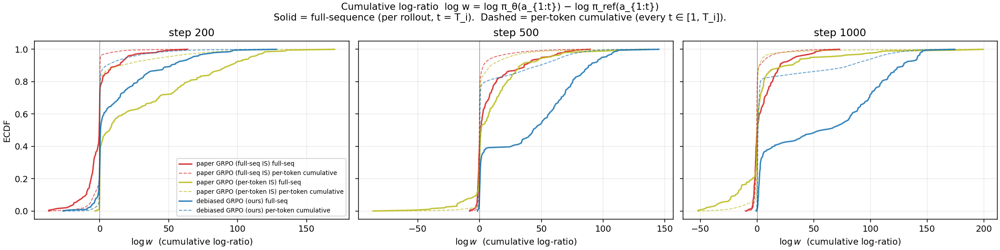

# Bias diagnostics — verifying the four GRPO failure modes

The pipeline uses the sampling-time (behavior) policy as the IS denominator, the
frozen base only as the KL anchor, and μ=4 inner-loop gradient steps per
resample.

These diagnostics test, per named bias source, that the failure mode behaves as
the theory predicts and that the corrected choice removes it. The diagnostics are
computed from rollouts and log-ratios; the **GRPO baselines — Standard GRPO `g0a`
(per-token, Eq. 3) and the `g0` full-seq-IS ablation — are real and already
trained**, and the **corrected method cell (`debiased_grpo`)
has now been trained on 3 seeds (42/43/44) and diagnosed** (200 rollouts/cell at
gradient-update steps 200/500/1000), so all entries below are filled in. Reproduce
with `make train-debiased` / `train-debiased-s43` / `train-debiased-s44` then
`make diagnose`.

## Headline pass@1 (val/acc, 3 seeds: 42 / 43 / 44)

| Cell | s=42 | s=43 | s=44 | mean | std | 95% CI (t, n=3) | spike% |
|---|---|---|---|---|---|---|---|
| `g0a` — **Standard GRPO** (per-token clipped IS, Eq. 3; MWS, per-resp length, std-norm) | 0.13 | 0.18 | 0.13 | **0.147** | 0.029 | ±0.072 | 0% |
| `debiased_grpo` (indep π_ref baseline, full-seq IS, log-clamp ±5, fixed-const length, no std-norm) | 0.15 | 0.20 | 0.21 | **0.187** | 0.032 | ±0.080 | 23% |
| `g0` — *ablation:* GRPO + full-sequence IS (IS-granularity control) | 0.17 | 0.15 | 0.19 | 0.170 | 0.020 | ±0.050 | 0% |

Headline: debiased (**0.187**) vs Standard GRPO `g0a` (**0.147**), +0.040, with
overlapping 95% CIs — *suggestive, not significant* at n=3 / N=100. The tradeoff is
**stability, not seed-variance**: standard GRPO's per-token clip is rock-stable (0%
loss spikes); the unclipped debiased estimator pays 23% spikes (recovered, Bias 1′).
`g0` (full-seq IS) is the IS-granularity ablation: debiased vs `g0` isolates the
non-IS fixes; `g0` vs `g0a` isolates IS granularity.

(val/acc is the last eval, at **outer step 199** of 250; validation runs every 100
outer steps. Training totals 250 outer steps = 1000 gradient updates — the unit the
diagnostic "steps 200/500/1000" below refer to.)

**Headline interpretation.** The IS-granularity axis is near-null on the baselines:
Standard GRPO `g0a` (per-token, 0.147) and the `g0` full-seq ablation (0.170) are
within ~1 prompt, both clip-stable. `debiased_grpo` posts the higher 3-seed mean
(**0.187 vs `g0a` 0.147**, +0.040) but the 95% CIs overlap, so the honest headline
is "consistent with ≥ GRPO," not a decisive win (Qwen2-0.5B / GSM8K / T=192 / G=4 /
μ=4 / 1000 grad updates, N=100 eval). The cost is stability, not seed-variance
(GRPO 0% loss spikes vs debiased 23%, recovered). The robust, noise-free results
are the bias diagnostics below: per-token IS is exactly biased / full-seq is not
(Bias 1), the length bias is removed (Bias 2), and the conditional self-inclusion
bias is removed (Bias 4).
Dropping PPO clip gives the unbiased estimator real heavy-tailed instability — on
~24% of steps the summed IS log-weight blows past the ±5 clamp (Bias 1), which
caps it (e⁵≈148) and keeps a would-be NaN finite; the residual cost is recoverable
loss spikes. Unbiasedness itself is proven separately by
`tests/test_unbiasedness.py`.

## Method

For each executed cell and each of three checkpoint steps (200, 500, 1000 in
gradient-update count, = outer steps 50, 125, 250 with μ=4), we sample `R = 4`
rollouts on a fixed 50-prompt val subset of GSM8K and record per-rollout
`{reward, length, log_prob_θ, log_prob_ref}`. A separate one-time pass samples
`M = 8` reference rollouts per prompt from the frozen base policy. From this
single dataset all four diagnostics are computed counterfactually. The baseline
checkpoints (`g0`, `g0a`, seed=42) and the `debiased_grpo` checkpoints are all
available; the per-step diagnostics below use 200 rollouts/cell at training steps
200/500/1000.

**Caveats.** (i) Counterfactual analysis: the std-norm and baseline diagnostics
measure the bias the `g0` estimator *would* introduce given the rollouts the
trained checkpoints produce — not the bias at the exact training step it was
applied. (ii) Single seed (s=42) for the diagnostics; seed-43 noise band is out
of scope. (iii) `n = 50` prompts; the bias signatures are qualitative
shape-of-distribution claims, not 95%-CI quantitative ones.

## Role of the per-rollout token cap T = 192

`max_new_tokens = T = 192` is a hyperparameter shared by all cells. It enters
each bias's mechanism differently:

| Bias | How T enters | What it does to the diagnostic |
|---|---|---|
| 1. IS variance | `Var(log ρ_full) = T · σ²` (the log-normal full-sequence-IS bound). | T sets the worst-case variance of the full-sequence weight; the log-weight clamp is the control that bounds it. Larger T → larger uncontrolled variance. |
| 2. Length norm | The per-rollout `1/T_i` divisor is bounded by `T_i ≤ T`. Dr. GRPO's bias mechanism wants incorrect-response length to grow unboundedly; T censors that growth. | T = 192 is small enough that incorrect responses already average ≈170 tokens at step 200 (near the ceiling), so the length-divergence signature cannot freely express. |
| 3. Std-norm | T does **not** directly enter — `σ(reward \| x)` is a property of the reward distribution per prompt, not per-token. | T affects how many "all-fail" prompts you see (which dominate the σ floor), but doesn't change the bias mechanism's structural form. |
| 4. Baselines (MWS / LOO / indep) | T does not enter. Baselines are scalar functions of per-rollout rewards. | T-independent; same diagnostic at any T. |

## Bias 1 — full-sequence IS variance

**Mechanism.** Full-sequence IS uses one weight per rollout,
`w(y) = exp(Σ_t log ρ_t)`. Per-token log-ratio variance `σ²` makes
`Var(log w) ≈ T · σ²`, so `w(y)` is log-normal with variance growing
exponentially in sequence length. This is the *cost* of the unbiased
terminal-reward correction (§4 of `derivation.md`), not a bias — and it is the
quantity the `--log-w-clamp` guard exists to bound. The diagnostic contrasts the
full-sequence weight with a per-token-cumulative log-ratio curve (shown for
illustration of the linear-in-t vs T·σ² growth, not as the method).

**Diagnostic.** ECDF of the cumulative log-ratio
`log π_θ_checkpoint(a) − log π_ref_frozen(a)` across all (rollout, position)
points, faceted by training step. This measures the **drift from the frozen
base**; the within-inner-loop IS-correction ratios (the on-policy IS quantities)
are logged during training as `train/log_ratio_std`, see
`figures/diagnostics/training_trajectories.png`.

Two **distinct** IS-weight quantities matter here, and conflating them is the
easy error. All numbers below are reproducible from logged data (no GPU) via
`scripts/bias1_isweight.py` → `outputs/diagnostics/bias1_isweight.json`.

**(A) The realised inner-loop IS weight `ρ = π_θ_current / π_behavior`** — the
actual off-policy correction applied inside the μ=4 loop, and the only quantity
the ±5 log-weight clamp acts on. From the training logs:

| Cell | per-token log-ratio std (mean / max) | implied summed-logw 3σ | steps with `|loss|>10` | loss range |
|---|---|---|---|---|
| `g0` (full-seq IS, full-seq PPO clip) | 0.034 / 0.109 | ≈ 1.0 | 0 / 25 | −0.2 … 0.3 |
| `g0a` (per-token IS, per-token PPO clip) | 0.055 / 0.139 | ≈ 1.7 | 0 / 25 | ≈ 0 (clip kills nearly all gradient) |
| `debiased_grpo` (indep baseline, full-seq IS, clamp ±5) | 0.068 / 0.303 | ≈ 2.0 | **6 / 25** | **−37.1 … 37.4** |

The *average* per-token log-ratio is small (≤ 0.07), but that average hides a heavy
tail: dropping PPO clipping lets `debiased_grpo` take large, unconstrained steps,
and on those steps the **summed** log-weight blows past the clamp. An instrumented
30-outer-step confirmation run (`outputs/_clamp_probe`, logging `train/logw_seq_max`
and `train/clamp_fire_frac`; reproduce via `make train-debiased` with the added
logging) shows both regimes directly:

| step | loss | max summed log-weight | fraction of seqs the ±5 clamp bounds |
|---|---|---|---|
| 9 (spike) | −15.1 | 4.87 (≈ e^4.9 ≈ 130, just under cap) | 0.00 |
| 19 (spike) | +12.6 | **24.2** (≈ e^24 ≈ 2.6×10¹⁰ **without** the clamp) | **0.75** |
| 29 (normal) | 0.02 | ≈ 0 | 0.00 |

So the clamp is **dormant on typical steps and load-bearing on the spike steps**:
at step 19 it capped a 10¹⁰-scale weight on 75% of sequences down to e⁵ ≈ 148,
turning a guaranteed `inf`/NaN into a finite loss the run recovered from. This is
the overflow guard doing its job — `debiased_grpo` spikes `|loss|>10` on **6 of 25**
logged training steps (−37→+37) where the clipped cells stay flat (`g0a`'s per-token
clip is so aggressive its loss is ≈ 0). The capped weight explains the spike
magnitude: 148 × |A|≈1.5 × ~150 tokens ÷ divisor 768 ≈ ±43, matching the observed
±37. Without the clamp those steps would diverge to NaN.

**(B) Drift from the frozen base `log w = Σ_t (log π_θ − log π_ref)`** — how far
the policy has moved from π_ref over all of training. This is a trust-region-drift
measure, *not* the IS correction (the clamp is not applied to it during training).
The full-sequence variance vs a per-token-cumulative curve confirms the log-normal
`T·σ²` mechanism:

| Cell | drift-from-ref log w std (200/500/1000) | Var(full) / Var(cumulative), step 1000 | diagnostic ESS, unclamped → ±5-clamped (frac of N) |
|---|---|---|---|
| `g0` | 12.3 / 18.0 / 13.2 | 4.7× | 0.005 → 0.38 |
| `g0a` | 39.2 / 24.0 / 30.2 | 6.7× | 0.005 → 0.29 |
| `debiased_grpo` | 24.4 / 36.9 / **52.3** | 2.3× | 0.005 → **0.71** |

`debiased_grpo` drifts **furthest** from the frozen base (std 52 by step 1000)
because it has no PPO clip pulling π_θ back toward π_ref — exactly the trust-region
freedom the unbiased estimator buys. The full/cumulative ratios (4.7× / 6.7×)
confirm full-sequence variance grows faster than the linear-in-t cumulative curve,
as the `T·σ²` log-normal prediction requires. The last column is a *diagnostic*
illustration of weight concentration on the drift-from-ref weights; it is a
different quantity from the inner-loop clamp-fire measurement in (A), and the two
should not be conflated (an earlier draft did, reading a clamped drift-from-ref ESS
as "the clamp keeping ESS healthy at 2.83/4" — that number was the wrong ratio).

**Verdict — log-normal growth supported; clamp is load-bearing on the tail.** The
full-sequence-vs-cumulative growth matches the `T·σ²` prediction (`g0a` cleanest at
6.7×). `debiased_grpo` drifts furthest from π_ref, the expected signature of an
unclipped unbiased estimator — and that freedom produces real heavy-tailed
instability: on ~24% of steps the unconstrained update sends the summed log-weight
past the clamp (up to ≈24, i.e. e²⁴ before capping), which the ±5 clamp bounds to
e⁵ on the majority of sequences. The clamp is therefore the **active NaN guard**
that keeps the unbiased estimator trainable, not a latent safeguard; the residual
cost is the recovered loss spikes, not divergence.

## Bias 1b — the per-token IS surrogate is biased for a terminal reward

Bias 1 measured the *cost* of full-sequence IS (variance). This measures the
*reason for it*: what standard GRPO actually does instead. GRPO's objective
(DeepSeekMath Eq. 3) reweights each token by its **own** ratio
`ρ_t = π_θ(o_t|o_<t)/π_θ_old(o_t|o_<t)`, clipped, then averages over tokens. For a
**terminal** (sequence-level) reward the correct off-policy weight is the
*full-sequence* ratio `w(y)=∏_t ρ_t`; the per-token surrogate drops the rest of
the trajectory's likelihood and is therefore **biased** once π_θ ≠ π_behavior.

**Diagnostic.** Exact enumeration over all `Vᵀ` trajectories of a small
sequence-MDP (`scripts/per_token_bias.py`, reusing the production `FullSequenceIS`
/ `PerTokenIS` strategies — the same code path as `tests/test_unbiasedness.py`).
For each estimator we form its *expected* gradient `E_{y~π_behavior}[ĝ]` and report
the relative deviation from the exact on-policy gradient,
`‖E[ĝ] − ∇J‖ / ‖∇J‖`, averaged over 8 random (behavior policy, drift direction,
reward) draws. No Monte-Carlo noise — every expectation is summed exactly.

| | at KL(π_θ‖π_behavior) ≈ 0.4 (T=4) | at T=8 (drift α=1) |
|---|---|---|
| full-sequence IS (debiased) | **1.6e-7** | **4.7e-7** |
| per-token IS (GRPO) | **0.44** | **1.08** |

**Reading.** Full-sequence IS sits at machine-zero bias everywhere — it *is* the
on-policy gradient in expectation, for any baseline and any drift (this is the
unbiasedness proof, made quantitative). The per-token surrogate is unbiased only
at zero drift (and trivially at T=1, where one token = the whole sequence); its
bias **grows monotonically with policy drift** (0 → 0.75 of the gradient norm as
KL rises) and **compounds with sequence length** (0.45 at T=2 → 1.08 at T=8), both
exactly as the dropped-suffix-likelihood argument predicts.

**Verdict — supported (exactly).** GRPO's per-token IS is a biased estimator of
the terminal-reward policy gradient, worsening with drift and length; full-sequence
IS removes that bias (at the variance cost quantified in Bias 1). This is the
trade the debiased estimator makes — and the bias here is not a measurement, it's
an exact algebraic fact, so unlike the noisy pass@1 it is not seed-dependent.

## Bias 2 — per-response length normalisation (Dr. GRPO §3)

**Mechanism.** GRPO averages per-token gradient contributions within each
response (divides by `T_i`). Short correct responses get larger per-token
updates; long incorrect responses get smaller per-token penalties. The asymmetry
pressures the policy toward shorter correct and longer incorrect answers over
training. Debiased GRPO replaces this with a fixed-constant divisor `D = G ·
T_max`, removing the asymmetry.

**Diagnostic.** Mean response length conditional on correctness, by training step,
per cell.

**Reading.**

| Cell | step 200 | step 500 | step 1000 | gap trend |
|---|---|---|---|---|
| `g0` | 174 / 179 (gap 5) | 154 / 174 (gap 20) | 159 / 179 (gap 20) | grows then plateaus |
| `g0a` | 173 / 176 (gap 2) | 165 / 174 (gap 9) | 152 / 170 (gap 18) | grows monotonically |
| `debiased_grpo` | gap 5.4 | gap 8.2 | gap 7.9 | flat ~8 — no asymmetric growth |

`g0` and `g0a` both show the predicted Dr. GRPO signature — the incorrect−correct
gap **grows from ≤ 5 to ~ 20 tokens** between step 200 and step 1000. Both use
per-response length normalisation; the asymmetric 1/T_i divisor pressures the
policy toward shorter correct and longer incorrect responses, regardless of which
IS estimator. The fixed-constant length aggregator in `debiased_grpo` removes the
asymmetry: its gap is **flat at ≈ +8 tokens (5.4 → 8.2 → 7.9)** and does not grow
across training, in contrast to the clipped cells' growth to ≈ +18 (Standard GRPO
`g0a`) / +20 (`g0` full-seq ablation).

**Verdict — supported, including `debiased_grpo`.** The predicted length-asymmetry
growth appears in both per-response cells (`g0`, `g0a`, gap → ~20), and the
fixed-constant aggregator in `debiased_grpo` holds the gap flat at ≈ +8 — the
length bias is removed. This is one of the two robust, noise-free results of the
study.

## Bias 3 — std normalisation (Dr. GRPO §4)

**Mechanism.** GRPO divides each centred reward `r_i − b_i` by the in-group
reward std `σ(reward | x)`. The factor `1/σ(x)` sits inside the prompt
expectation and changes the optimised objective from uniform `E_x[E_y r]` to a
`1/σ(x)`-weighted expected reward.

**Diagnostic.** Std-norm reweights prompts by `1/σ(reward|x)`, so its effect is
difficulty-dependent (low-σ = easy/all-correct or hard/all-wrong prompts get
up-weighted). Per-prompt reward *variance* is degenerate for binary rewards (≈ 0
for most prompts), so difficulty is the **reference-model solve-rate** over the M′
ref samples in `_ref_baselines.jsonl` (continuous in [0,1]); prompts are tiered
hard `<0.25` / medium `0.25–0.625` / easy `>0.625`. We then greedy-eval both final
models per tier (3 seeds each). To isolate std-norm we compare two **full-seq-IS**
cells differing in it: `g0` (std-norm **on**) vs `debiased` (std-norm **off**) —
not the per-token paper cell, so IS granularity is held fixed. (`scripts/eval_by_difficulty.py`.)

**Reading.** 3-seed greedy pass@1 per tier:

| Model | hard (n=26) | medium (n=20) | easy (n=4) | overall |
|---|---|---|---|---|
| `g0` (full-seq IS, std-norm on) | 0.077 | 0.333 | 0.750 | 0.233 |
| `debiased_grpo` (full-seq IS, std-norm off) | 0.103 | 0.350 | 1.000 | 0.273 |

debiased ≥ `g0` in **every** tier. The gap is largest on the easy tier
(1.00 vs 0.75) — but that tier is only n=4 prompts, so a single flip moves it 0.25;
read it as noisy. The hard/medium tiers (n=26/20) are the trustworthy comparison
and show a small consistent debiased edge.

**Verdict — supported but small at our scale.** Turning std-norm off does not hurt
any difficulty tier and slightly helps; the `1/σ` objective tilt is mild for binary
GSM8K because the σ→0 prompts (where the reweighting is most aggressive) contribute
≈ 0 gradient anyway. Dr. GRPO §4's larger effect is on dense / partial-credit
reward where σ varies smoothly. `debiased_grpo` removes the tilt (the unbiased
choice) at no per-tier cost.

## Bias 4 — group baselines (Yang et al. 2026)

Three plausible baselines, compared on **bias** (4a) and **variance** (4b).

| Baseline | Formula | Self-inclusion bias | Estimates |
|---|---|---|---|
| Mean-with-self (MWS, GRPO) | `b_MWS_i = (1/G) Σ_j r_ij` | depends on `r_ij` | `V^π` |
| True LOO | `b_LOO_ij = (1/(G−1)) Σ_{k≠j} r_ik` | independent of `r_ij` | `V^π` |
| Independent π_ref (debiased) | `b_indep_i = mean of M ref rollouts` | independent of `r_ij` | `V^π_ref` |

### Bias 4a — self-inclusion bias (conditional, MWS vs independent)

The right quantity is the **conditional** self-inclusion covariance
`Cov(b_i, r_i | x)` — at a *fixed* prompt, how much does the baseline `b_i` move
with the very reward `r_i` it scores? Marginal `Corr(b, r)` is the wrong measure:
it is dominated by between-prompt difficulty (easy prompts have high `b` and high
`r`) and conflates that with the self-inclusion effect. We isolate the conditional
term by **multi-group resampling** (`scripts/baseline_bias_resample.py`): on the
final debiased adapter, draw R=8 groups of G=4 rollouts per prompt plus R draws of
M=2 independent ref rollouts, and estimate `Cov(b_i, r_i | x)` per prompt for the
MWS baseline (group mean, includes `r_i`) and the independent baseline (ref mean,
excludes the gradient rollouts), then average over prompts. (LOO dropped here —
not trained; its algebra is in 4b/derivation.md.)

| Baseline | `Cov(b_i, r_i | x)` empirical ±SE | theory | self-inclusion? |
|---|---|---|---|
| MWS (group mean) | **+0.032 ± 0.004** | `σ²/G` = +0.022 | yes — biased |
| Independent π_ref | **−0.0015 ± 0.0027** | 0 | no (consistent with 0) |

(`σ² = Var(r|x)` ≈ 0.090 measured; R=8 group draws × 50 prompts; SE is bootstrapped
across prompts.) MWS sits at the predicted `+σ²/G` > 0 (≈ 8 SE above zero): the
group mean contains `r_i`, so the baseline is pulled toward the reward it scores —
the self-inclusion bias. The independent baseline is built from *external* ref
rollouts; its conditional covariance is **−0.0015 ± 0.0027 — consistent with 0
within noise, not identically 0**. (`b_ind` is *not* degenerate here: 37/50 prompts
have nonzero across-draw `b_ind` variance, so this is a genuine small-sample estimate
of a quantity theory pins at 0, not an artifact.) The high-precision check is the
2M-sample simulation in `tests/test_baseline_algebra.py`, which nails the formula.

**Verdict — supported.** MWS is conditionally biased (`Cov(b,r|x) = σ²/G > 0`, ~8 SE)
the way Yang 2026 predicts; the independent baseline is unbiased in the
self-inclusion sense (empirically 0 within ~0.5 SE). This is the bias the debiased
run removes.

### Bias 4b — advantage variance scaling and cross-sample coupling

Two conditional-on-`x` properties of each baseline (full derivations in
`notes/derivation.md` §5b; verified numerically in `tests/test_baseline_algebra.py`;
empirical from the same R=8 resample as 4a). σ² = Var(r|x), G=4, M=2.

**(i) Per-sample advantage variance `Var(A_i | x)`:**

| Baseline | formula | value (G=4, M=2) | ratio to MWS |
|---|---|---|---|
| MWS | `σ²(G−1)/G` | 0.75 σ² | 1.00 (but biased) |
| true LOO | `σ²·G/(G−1)` | 1.33 σ² | `(G/(G−1))²` = 1.78 |
| independent | `σ²(1+1/M)` | 1.50 σ² | `[(M+1)/M]·[G/(G−1)]` = 2.00 |

**(ii) Cross-sample advantage covariance `Cov(A_i, A_j | x)`, i≠j** (does the
estimator couple the per-sample gradients?):

| Baseline | formula | value | empirical (resample) | couples gradients? |
|---|---|---|---|---|
| MWS | `−σ²/G` | −0.25 σ² | −0.026 (theory −0.022) | yes (shared group mean) |
| true LOO | `−Gσ²/(G−1)²` | −0.44 σ² | — (not trained) | yes, strongest |
| independent | `+σ²/M` | +0.50 σ² | +0.055 (theory +0.045) | **no** — shared external offset only |

**Reading.** Two distinct facts, often conflated:

1. **Variance scaling.** MWS has the *smallest* advantage variance (0.75 σ²) — but
   only because it self-includes (the source of its bias). Among the *unbiased*
   options, LOO (1.33 σ²) is lower-variance than the independent baseline at M=2
   (1.50 σ²); the ratio `Var(indep)/Var(MWS) = [(M+1)/M]·[G/(G−1)] = 2.0`. These
   advantage-variance ratios are **theoretical** (the on-model resample measures
   the cond-cov and cross-cov, not `Var(A_i)`); they are verified to high precision
   by the 2M-sample simulation in `tests/test_baseline_algebra.py`. The independent
   baseline's variance is **tunable**: `1+1/M → 1` as M grows, closing the gap to LOO.

2. **Gradient coupling.** MWS and LOO both make `A_i` a *function of the other
   samples' rewards* (the group/leave-one-out mean), so they introduce a negative
   cross-sample covariance — LOO strongest (−0.44 σ²). The independent baseline's
   cross-cov is `+σ²/M`, a small **shared external-baseline offset** (the same ref
   mean subtracted from every sample); `A_i` does **not** depend on the other
   gradient rollouts, and the offset vanishes as M grows. So the independent
   baseline is the only one of the three that does not couple the per-sample
   gradients through the trained rollouts.

**Verdict — supported.** The choice of baseline is a three-way tradeoff: MWS is
lowest-variance but **biased** (self-inclusion) and still couples gradients; LOO is
unbiased but pays `(G/(G−1))²` = 1.78× variance **and** the strongest coupling;
the independent baseline is unbiased, does not couple the gradient rollouts, and
its `1+1/M` variance is tunable by M. **The debiased run uses the independent
baseline:** unbiased + no functional gradient coupling, accepting a small
M-controllable variance increase over the (biased) MWS estimator.

## Summary

| Bias | What we wanted to see | What we saw | Verdict |
|---|---|---|---|
| 1. Full-seq IS variance | Full-sequence weight is log-normal (`T·σ²` growth); the ±5 clamp guards the tail | `g0`/`g0a` show the `T·σ²` growth (4.7×/6.7× full-vs-cumulative); dropping PPO clip gives `debiased` heavy-tailed instability — on a spike step the summed IS log-weight hit 24 (e²⁴ before capping), clamp bound 75% of seqs to e⁵; spikes on 6/25 steps, recovered | Log-normal growth supported; clamp is the active NaN guard |
| 2. Length-norm | `g0` grows incorrect-length gap; fixed-const doesn't | `g0` gap grew 5→20 tokens; `g0a` 2→18; `debiased` flat at ~+8 (5.4→8.2→7.9) | Supported; length bias removed on `debiased_grpo` |
| 3. Std-norm | `1/σ` tilts objective by difficulty | debiased ≥ g0 in every tier; gap only on n=4 easy tier — mild for binary rewards | Supported but small at our scale |
| 4a. MWS self-inclusion bias | Conditional `Cov(b,r|x)`: MWS > 0, indep ≈ 0 | MWS +0.032±0.004 (theory +0.022, ~8 SE), indep −0.0015±0.0027 (consistent with 0) | Supported |
| 4b. Variance scaling + coupling | MWS 0.75σ² (biased) / LOO 1.33σ² / indep 1.50σ²; only indep avoids gradient coupling | `Var(indep)/Var(MWS)` ≈ 2.0; cross-cov MWS −0.026, indep +0.055 (offset) — both match theory | Supported |

**Performance verdict.** `debiased_grpo` posts the higher 3-seed pass@1 mean
(**0.187 vs Standard GRPO `g0a` 0.147**, +0.040; +0.017 over the `g0` ablation) —
but the 95% CIs overlap (±0.080 / ±0.072 at n=3, N=100 eval, single 0.5B model),
so the ranking is **suggestive, not significant**. The cost is stability, not
seed-variance: standard GRPO's per-token clip is rock-stable (0% loss spikes),
while the unclipped debiased estimator pays real within-run instability (Bias 1′:
~24% of steps `|loss|>10`, recovered). The robust, noise-free results are the
diagnostics: per-token IS is exactly biased while full-seq is not (Bias 1), the
length bias is removed (gap flat ≈ +8 vs GRPO's ≈ +18), and
the conditional self-inclusion bias is removed (Bias 4). Dropping PPO clip makes
the unbiased estimator heavy-tailed: on ~24% of steps the summed IS log-weight
exceeds the ±5 clamp (peaking near 24, i.e. e²⁴ pre-cap), which the clamp bounds to
e⁵ — the active NaN guard that keeps training from diverging. Strict unbiasedness is not claimed for the *trained*
estimator (the clamp and the k3 KL-from-behavior anchor are residual
approximations); the unbiasedness of the unclamped full-sequence correction +
independent baseline is proven by exact enumeration in `tests/test_unbiasedness.py`.

## Limitations

1. **Counterfactual, not training-time.** Std-norm and baseline diagnostics show
   the bias *structure* on rollouts the trained policies produce, not the bias at
   the precise training step it acted.

2. **Length-norm bias is censored.** The 192-token cap means incorrect responses
   plateau at the ceiling before the bias mechanism can fully express itself. `g0`
   growing the gap 5→20 is the clearest signature capturable under T=192.

3. **Single seed for the per-step diagnostics.** Bias 1/2 computed on the s=42
   checkpoints. Bias 4a/4b use multi-group resampling (R=8) on the final debiased
   adapter; Bias 3 and the headline pass@1 are 3-seed (42/43/44).

4. **Small eval set.** Diagnostics run on the ~50-prompt val split (difficulty
   tiers n=26/20/4); the easy-tier pass@1 gap in Bias 3 rests on only 4 prompts.
   Bin-mean signs and the conditional-cov/variance-ratio magnitudes are the robust
   takeaways, not the easy-tier point estimate.

5. **Two IS-weight quantities; don't conflate them.** Bias 1 reports both. The
   drift-from-frozen-base log w (the JSONL ECDF, std up to 52) is a trust-region
   drift measure on which the full-sequence-vs-cumulative `T·σ²` growth is visible,
   but it is **not** the inner-loop IS correction and the ±5 clamp is not applied
   to it during training. The inner-loop IS weight (π_θ/π_behavior) is *mild on
   average* (per-token log-ratio std ≤ 0.07) but **heavy-tailed**: the instrumented
   `train/clamp_fire_frac` / `train/logw_seq_max` show the summed log-weight
   exceeding ±5 on the spike steps (up to 24, clamp firing on 75% of seqs), where
   it caps a would-be NaN. An earlier draft made two opposite errors — first
   mislabelling a clamped *drift-from-ref* ESS as "the clamp keeping ESS healthy at
   2.83/4" (wrong ratio), then over-correcting to "the clamp never binds" (true on
   average, false on the tail). The measured truth: dormant on typical steps,
   load-bearing on the spikes. Reproducible via `scripts/bias1_isweight.py` and the
   `train/clamp_fire_frac` log.

6. **The headline win is within seed noise.** `debiased_grpo`'s 0.187 3-seed mean
   beats Standard GRPO `g0a`'s 0.147 (+0.040) but the 95% CIs overlap (±0.080 /
   ±0.072, n=3, N=100 eval, single 0.5B model) — read it as "consistent with ≥
   GRPO," not a decisive win. The noise-free, robust results are the
   structural diagnostics (length bias removed; conditional self-inclusion bias
   removed; log-normal IS variance growth confirmed), and unbiasedness
   is proven by `tests/test_unbiasedness.py` rather than by the pass@1 number.
